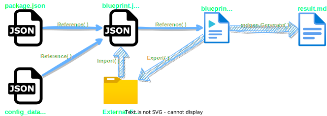

<!--- Source file(s) of this README: -->
<!--- 
Markdown: input: "_readme_blueprint.md" 
JSON: input config: "_readme_blueprint.json" 
JSON: config data: "config_data.json" 
JSON: package: "package.json" -->


<br />
<div align="center">
  <a href="https://github.com/renhong-zhang/enhanced-markdown-generator">
    
  </a>

  <h3 align="center">@renhong-zhang/enhanced-markdown-generator</h3>

  <p align="center">
    <b>Create gorgeous markdown files with data specified in json files, beautiful badges, svgs, and any other elements you desire in a simple way.</b></br>
        <br>
        <a href="#getting-started"><strong>Explore enhanced-markdown-generator Docs »</strong></a>
        <br>
        <br>
        <a href="https://github.com/renhong-zhang/enhanced-markdown-generator#Demo">View Demo</a>
        ·
        <a href="https://github.com/renhong-zhang/enhanced-markdown-generator/issues/new?assignees=-&labels=bug&template=bug_report.yml">Report
          bug</a>
        ·
        <a href="https://github.com/renhong-zhang/enhanced-markdown-generator/issues/new?assignees=&labels=feature&template=feature_request.yml">Request
          feature</a>
  </p>
</div>

<p align="left">
<table border="0" width="100%" id="badge" cellspacing="0" cellpadding="0">
  <tr>
    <td>Prerequisites</td>
    <td><a href="https://www.bing.com/search?q=Node-js"></a> <a href="https://www.bing.com/search?q=npm"></a></td>
  </tr>
  <tr>
    <td>Languages & Tools</td>
    <td><a href="https://www.bing.com/search?q=TypeScript"></a> <a href="https://www.bing.com/search?q=Markdown"></a></td>
  </tr>
  <tr>
    <td>License</td>
    <td><a href="https://opensource.org/licenses/GPL-3.0"></a></td>
  </tr>
  <tr>
    <td>State</td>
    <td><a href="https://github.com/renhong-zhang/enhanced-markdown-generator/graphs/commit-activity"></a></td>
  </tr>
</table>
</p>

<p align="center"><a href="#table-of-contents"></a></p>

<details open>
	<summary><big><b>Table of Contents</big></b></summary>
	<ol>
		<li><a href="#demo">Demo</a></li>
<li><a href="#about-the-project">About The Project</a></li>
<ul><li><a href="#built-with">Built With</a></li></ul>
<li><a href="#getting-started">Getting Started</a></li>
<ul><li><a href="#prerequisites">Prerequisites</a></li></ul>
<ul><li><a href="#installation">Installation</a></li></ul>
<ul><ul><li><a href="#install-the-package">Install the Package</a></li></ul></ul>
<ul><ul><li><a href="#complie-and-install">Complie and Install</a></li></ul></ul>
<li><a href="#usage">Usage</a></li>
<ul><li><a href="#quick-start">Quick Start</a></li></ul>
<ul><li><a href="#file-structure">File Structure</a></li></ul>
<ul><li><a href="#basic-usage">Basic Usage</a></li></ul>
<ul><li><a href="#reference-data-in-json">Reference Data in JSON</a></li></ul>
<ul><ul><li><a href="#default-__config__">Default `__config__`</a></li></ul></ul>
<ul><li><a href="#formatter">Formatter</a></li></ul>
<ul><ul><li><a href="#declare-formatter-in-json">Declare Formatter in JSON</a></li></ul></ul>
<ul><ul><ul><li><a href="#supported-case-processing-methods">Supported Case-processing Methods</a></li></ul></ul></ul>
<ul><ul><li><a href="#nested-formatter">Nested Formatter</a></li></ul></ul>
<ul><li><a href="#pipe-process">Pipe Process</a></li></ul>
<ul><ul><li><a href="#filter">Filter</a></li></ul></ul>
<ul><ul><li><a href="#exporter-">Exporter </a></li></ul></ul>
<ul><ul><ul><li><a href="#path">`path`</a></li></ul></ul></ul>
<ul><ul><ul><li><a href="#format">format</a></li></ul></ul></ul>
<ul><li><a href="#foldable-table-of-contentstoc">Foldable Table of Contents(TOC)</a></li></ul>
<ul><li><a href="#find-out-the-path-of-object">Find out the Path of Object</a></li></ul>
<ul><li><a href="#configurations">Configurations</a></li></ul>
<li><a href="#roadmap">Roadmap</a></li>
<li><a href="#changelog">Changelog</a></li>
<li><a href="#code-contributors">Code Contributors</a></li>
<li><a href="#contributing">Contributing</a></li>
<li><a href="#author-">Author </a></li>
<li><a href="#how-can-i-support-you">How can I support you?</a></li>
<li><a href="#acknowledgments">Acknowledgments</a></li>
<li><a href="#license">License</a></li>
	</ol>
</details>

<p align="center"><a href="#demo"></a></p>


## Demo


<p align="center"><a href="assets/demo.gif"></a></p>

<p align="center"><a href="#about-the-project"></a></p>


## About The Project


When I worked on multiple projects simultaneously, the complexity of updating information that is repeatedly referenced in the `README.md` became apparent to me. Adding badges and uniquely styled SVGs to the `README.md` file on GitHub was also a challenge; despite trying numerous open-source tools, I was unable to find one that met my needs while also being intuitive to use. Therefore, I spent a month and a half developing this Enhanced Markdown Generator based on the code framework of a [readme-generator](https://github.com/andreasbm/readme) project and adapt it to the markdown template I developed for all of my projects. My Enhanced Markdown Generator also serves as the backbone for all of my GitHub repositories.


### Built With


<p align="left">
<table border="0" width="100%" id="badge" cellspacing="0" cellpadding="0">
  <tr>
    <td><b>Major Frameworks/Libraries</b></td>
    <td>
      <a href="https://www.bing.com/search?q=Node-js"></a><br><a href="https://www.bing.com/search?q=npm"></a><br><a href="https://www.bing.com/search?q=TypeScript"></a>
    </td>
  </tr>
</table>
</p>

<p align="center"><a href="#getting-started"></a></p>


## Getting Started

With the features mentioned below, you could easily write a Markdown file like the one you are reading with beautiful badges, SVGs, Table of Contents and any other styles you like.


### Prerequisites


* `npm`: `>=9.2.0 <9.3.0`
* `node`: `>=19.4.0 <19.5.0`


### Installation


There are two installation options: install the prebuilt package or compile and install the source code.


#### Install the Package

Download the `.tgz` package from the [latest release](https://github.com/renhong-zhang/enhanced-markdown-generator/releases/latest). And install the downloaded file with:
```shell
npm install --global PATH_TO_THE_FILE.tgz
```
Example:
```shell
npm install --global renhong-zhang-enhanced-markdown-generator-1.0.0.tgz
```


#### Complie and Install

Compile and install the Source Code with running the script `install.sh` in the project directory:
```shell
cd Enhanced_Markdown_Generator
./install.sh
```
If you have installed the code before, run the following command:
```shell
cd Enhanced_Markdown_Generator
./uninstall.sh && ./install.sh
```

<p align="center"><a href="#usage"></a></p>


## Usage


### Quick Start

After installation is done, run the example files to check if the installation is successful. Run the command:
```
./_Example/genreadme
```
As the Code of `_Example/genreadme` shows:

```shell
#!/bin/bash
#* this scrpit is used to generate README.md from json
PROJECT_PATH="$1"

if [ -z "$PROJECT_PATH" ]
then
      echo "\$PROJECT_PATH is empty"
      PROJECT_PATH="$(pwd)"
else
      echo "\$PROJECT_PATH is NOT empty"
fi

echo "Project Path is: $PROJECT_PATH"

PACKAGE_JSON_PATH="$PROJECT_PATH/package.json"
README_BLUEPRINT_JSON_PATH="$PROJECT_PATH/_Example/blueprint.json"
README_BLUEPRINT_MARKDOWN_PATH="$PROJECT_PATH/_Example/blueprint.md"
README_CONFIG_DATA_JSON_PATH="$PROJECT_PATH/_Config/config_data.json"
README_MARKDOWN_PATH="$PROJECT_PATH/example_result.md"

npx mdgen generate --config "$README_BLUEPRINT_JSON_PATH" --package "$PACKAGE_JSON_PATH" --input "$README_BLUEPRINT_MARKDOWN_PATH" --output "$README_MARKDOWN_PATH" --data "$README_CONFIG_DATA_JSON_PATH"

```

The `blueprint.json`, `blueprint.md`, (optional)`package.json`, and (optional)`config_data.json` are all the files you need to generate a markdown file. The `mdgen` is the command to generate the markdown file, you run it with `npx mdgen generate YOUR_CONFIGURATIONS`. The configurations are listed at the end of this section.

Also, the explaination of each syntax is mentioned below.


### File Structure


<div align="center">
<p align="center"><a ></a></p>
</div>

The Contents of each file is as shown below:

| Filename           | File's Content                                   |
|--------------------|--------------------------------------------------|
| `package.json`     | Configuration of your package to be installed    |
| `config_data.json` | Data that could be reused in different repositories |
| `blueprint.json`   | Data for specific repository                     |
| `blueprint.md`     | Markdown file as the template of generated file  |
| `result.md`        | Markdown file generated from the `blueprint.md`  |


### Basic Usage

In `blueprint.md`, use the following syntax to refer to data stored in `blueprint.md`:
```markdown
{-- PATH_OF_TARGET_IN_BLUEPRINT --}
```
In `blueprint.json`: Store data like normal json files, support `string`, `array`, and `dict`.

**Example**:
In `blueprint.md`:
```markdown
target text: 
{-- EXAMPLE.text --}
target array: 
{-- EXAMPLE.array --}
target array-value: 
{-- EXAMPLE.array.0 --}
target dict: 
{-- EXAMPLE.dict --}
target dict-value: 
{-- EXAMPLE.dict.key-0 --}
target 2D-array: 
{-- EXAMPLE.array-2D --}
target 2D-array-sub-array: 
{-- EXAMPLE.array-2D.1 --}
target 2D-array-sub-array-value: 
{-- EXAMPLE.array-2D.1.0 --}
```
In `blueprint.json`:
```json
"EXAMPLE": {
    "text": "Test Text Reference",
    "array": [
        "Test",
        "Array",
        "Reference"
    ],
    "array-2D": [
        [
            "col 1",
            "col 2"
        ],
        [
            "value 1-1",
            "value 1-2"
        ],
        [
            "value 2-1",
            "value 2-2"
        ]
    ],
    "dict": {
        "key-0": "value 0",
        "key-1": "value 1",
        "key-2": "value 2"
    }
}
```
Result Text in `README.md`: 
```markdown
target text: 
Test Text Reference
target array: 
* Test
* Array
* Reference
target array-value: 
Test
target dict: 
{
    "key-0": "value 0",
    "key-1": "value 1",
    "key-2": "value 2"
}
target dict-value: 
value 0
target 2D-array: 

| col 1     | col 2     |
|-----------|-----------|
| value 1-1 | value 1-2 |
| value 2-1 | value 2-2 |

target 2D-array-sub-array: 
* value 1-1
* value 1-2
target 2D-array-sub-array-value: 
value 1-1
```
Result After Being Rendered in GitHub:
target text: 
Test Text Reference

target array: 
* Test
* Array
* Reference

target array-value: 
Test

target dict: 
{
    "key-0": "value 0",
    "key-1": "value 1",
    "key-2": "value 2"
}

target dict-value: 
value 0

target 2D-array: 

| col 1     | col 2     |
|-----------|-----------|
| value 1-1 | value 1-2 |
| value 2-1 | value 2-2 |

target 2D-array-sub-array: 
* value 1-1
* value 1-2

target 2D-array-sub-array-value: 
value 1-1


### Reference Data in JSON

In any `.json` used as input of this generator, path of objects could be shortened by defining an `__object__` object in it, the syntax is:
```json
"YOUR_OBJ_KEY": {
   "__config__": {
      "prefix": "YOUR_PREFIX",
      "suffix": "YOUR_SUFFIX"
   }
   "YOUR_SUB_OBJ_KEY": "YOUR_SUB_OBJ_VALUE"
}
```
Then, you can access the value of the sub-obj in the value of another obj with:
```json
"YOUR_PREFIXANOTHER_KEYYOUR_SUFFIX": "RELATIVE_PATH_TO_YOUR_OBJ_KEY"
```
**Example**:
In `blueprint.json`:
```json
"EXAMPLE-ref-target": {
  "temp-key": {
        "text": "Test Text Reference",
   		"array": [
   			"Test",
   			"Array",
   			"Reference"
   		],
   		"array-2D": [
   			[
   				"col 1",
   				"col 2"
   			],
   			[
   				"value 1-1",
   				"value 1-2"
   			],
   			[
   				"value 2-1",
   				"value 2-2"
   			]
   		],
   		"dict": {
   			"key-0": "value 0",
   			"key-1": "value 1",
   			"key-2": "value 2"
   		}
      },
  "__config__": {
      "_prefix": "<<",
      "_suffix": ">>",
  },
"<<EXAMPLE-ref>>": "temp-key.dict"
}
```
In `blueprint.md`:
```markdown
ref-result-1:
{-- EXAMPLE-ref --}

ref-result-1-1:
{-- EXAMPLE-ref.key-0 --}
```
And the result in `README.md`:
Result Text in `README.md`: 
```markdown
ref-result-1:
{
    "key-0": "value 0",
    "key-1": "value 1",
    "key-2": "value 2"
}

ref-result-1-1:
value 0
```
Result After Being Rendered in GitHub:
ref-result-1:
{
    "key-0": "value 0",
    "key-1": "value 1",
    "key-2": "value 2"
}

ref-result-1-1:
value 0


#### Default `__config__`

`"prefix": "--"`: Refer to the absolute path of the object,
`"prefix": "->"`: Refer to the External Plain Text Files with the Absolute Path or the Relative Path to the CWD(current working directory),
`"prefix": "=>"`: Refer to the External JSON Files with the Absolute Path or the Relative Path to the CWD(current working directory),


### Formatter

The Formatter is the key feature that makes quick styling elements possible. For example, you could easily use badges like below in your markdown file with little code.
<a href="https://www.bing.com/search?q=TypeScript"></a> <a href="https://www.bing.com/search?q=Markdown"></a>


#### Declare Formatter in JSON

To declare an object is an Formatter, use `__formatter__` object as below:
```json
"__formatter__": {
   "format": "{-- OBJ_RELA_PATH:CASE_PROCESS_METHOD --}NORMAL_TEXT",
   "delimiter": "DELIMITER_STRING"
}
```
**Simple Example**
In `blueprint.json`
```json
"EXAMPLE-formatter": {
		"__formatter__": {
			"format": "Convert Case: {--text:upper:encode--}, {--dict.key-0:camel--}",
			"delimiter": ""
		},
		"temp-0": {
			"text": "Test Text Reference",
			"dict": {
				"key-0": "value 0",
				"key-1": "value 1",
				"key-2": "value 2"
			}
		},
		"temp-1": {
			"text": "Another Text",
			"dict": {
				"key-0": "Another value 0",
				"key-1": "Another value 1",
				"key-2": "Another value 2"
			}
		}
	}
```

In `blueprint.md`
```markdown
{-- EXAMPLE-formatter --}
```

Result
```markdown
Convert Case: TEST%20TEXT%20REFERENCE, value0Convert Case: ANOTHER%20TEXT, anotherValue0
```


##### Supported Case-processing Methods

When Input is `Enhanced Markdown Generator: a POWERFUL generator. "中文测试"`, the Output text with the correspond Case-processing keyword is shown below:
<p align="center">
<table align="center" border="0" width="100%" id="badge" cellspacing="0" cellpadding="0">
  <tr><td><b>Process Keyword</b></td><td><b>Output</b></td></tr>
  <tr><td>upper</td>
<td>ENHANCED MARKDOWN GENERATOR: A POWERFUL GENERATOR. "中文测试"</td></tr>
<tr><td>lower</td>
<td>enhanced markdown generator: a powerful generator. "中文测试"</td></tr>
<tr><td>camel</td>
<td>enhancedMarkdownGenerator:APOWERFULGenerator."中文测试"</td></tr>
<tr><td>title</td>
<td>Enhanced Markdown Generator a POWERFUL Generator</td></tr>
<tr><td>standard</td>
<td>Enhanced Markdown Generator a POWERFUL generator 中文测试 </td></tr>
<tr><td>id</td>
<td>Enhanced-Markdown-Generator-a-POWERFUL-generator</td></tr>
<tr><td>color-hex-code</td>
<td>EnhancedMarkdownGeneratoraPOWERFULgenerator</td></tr>
<tr><td>encode</td>
<td>Enhanced%20Markdown%20Generator%3A%20a%20POWERFUL%20generator.%20%22%E4%B8%AD%E6%96%87%E6%B5%8B%E8%AF%95%22</td></tr>
<tr><td>encode:decode</td>
<td>Enhanced Markdown Generator: a POWERFUL generator. "中文测试"</td></tr>
<tr><td>encode-base64</td>
<td>RW5oYW5jZWQgTWFya2Rvd24gR2VuZXJhdG9yOiBhIFBPV0VSRlVMIGdlbmVyYXRvci4gIuS4reaWh+a1i+ivlSI=</td></tr>
<tr><td>encode-base64:decode-base64</td>
<td>Enhanced Markdown Generator: a POWERFUL generator. "中文测试"</td></tr>
<tr><td>escape</td>
<td>Enhanced Markdown Generator: a POWERFUL generator. \"中文测试\"</td></tr>
</table>
</p>
And some case-processing methods for variable and filename are also supported, with UPPERCASE word protection:
<p align="center">
<table align="center" border="0" width="100%" id="badge" cellspacing="0" cellpadding="0">
  <tr><td><b>Process Keyword</b></td><td><b>Output</b></td></tr>
  <tr><td>lowercase</td>
<td>enhancedmarkdowngeneratoraPOWERFULgenerator</td></tr>
<tr><td>uppercase</td>
<td>ENHANCEDMARKDOWNGENERATORAPOWERFULGENERATOR</td></tr>
<tr><td>camelcase</td>
<td>enhancedMarkdownGeneratorAPOWERFULGenerator</td></tr>
<tr><td>pascalcase</td>
<td>EnhancedMarkdownGeneratorAPOWERFULGenerator</td></tr>
<tr><td>snakecase</td>
<td>enhanced_markdown_generator_a_POWERFUL_generator</td></tr>
<tr><td>kebabcase</td>
<td>enhanced-markdown-generator-a-POWERFUL-generator</td></tr>
<tr><td>snakeuppercase</td>
<td>ENHANCED_MARKDOWN_GENERATOR_A_POWERFUL_GENERATOR</td></tr>
<tr><td>snakepascalcase</td>
<td>Enhanced_Markdown_Generator_A_POWERFUL_Generator</td></tr>
<tr><td>kebabuppercase</td>
<td>ENHANCED-MARKDOWN-GENERATOR-A-POWERFUL-GENERATOR</td></tr>
<tr><td>kebabpascalcase</td>
<td>Enhanced-Markdown-Generator-A-POWERFUL-Generator</td></tr>
<tr><td>titlecase</td>
<td>Enhanced Markdown Generator A POWERFUL Generator</td></tr>
</table>
</p>


#### Nested Formatter

With Nested Formatter, you can make complex structures from the JSON data.
For example, you can customize a badge table like below:

<p align="center">
<table align="center" border="0" width="100%" id="badge" cellspacing="0" cellpadding="0">
  <tr><td><b>Project Link</b></td><td><b>Relative Skills</b></td></tr>
  <tr><td><a href="https://github.com/renhong-zhang/stm32-crawler-robot-platform"></a></td>
<td><a href="#"></a> <a href="#"></a> <a href="#"></a> <a href="#"></a> <a href="#"></a> <a href="#"></a> <a href="#"></a> <a href="#"></a> <a href="#"></a></td></tr>
<tr><td><a href="https://github.com/renhong-zhang/eeg-emotion-recognition-with-vit"></a></td>
<td><a href="#"></a> <a href="#"></a> <a href="#"></a></td></tr>
<tr><td><a href="https://github.com/renhong-zhang/quick-search-tool"></a></td>
<td><a href="#"></a> <a href="#"></a></td></tr>
</table>
</p>


### Pipe Process


The pipe feature extends **Object's Reference Syntax**:
```
{-- PATH_OF_TARGET_IN_BLUEPRINT || SUB_OBJECT_FILTER >> EXPORT_PARAMETERS --}
```

The Pipe Command is extensible, its parameters are passed in with normal JSON style.


#### Filter

With filter, you can format only part of the formatter obj, with custom logical conditions. Available keys are `key`, `logic`, and any other keys of the sub-obj in the object with formatter object.


#### Exporter 

As the `<style>` tag is not available in GitHub's `README.md`, and the only hack is to embed styles in an `.svg` file, a feature of operating file's content directly is strongly needed. The Exporter is created to help you customize any plain text files with Formatter's syntax.
The exporter exports the referenced data to a file, and makes it possible to reference the exported file instead. `.Together with import and formatter features mentioned above, you could use this feature to make customized animated SVG image like below:
With simply:
In `blueprint.json`
```json
"head_svg": {
		"__formatter__": {
			"->format": "_Template/user_name__type_gradient.svg",
			"delimiter": " "
		},
		"info": {
			"$$name": "owner.name",
			"color": {
				"$$text": "text-color",
				"$$background": "background-color-gradient"
			}
		}
	}
```
In `blueprint.md`:
```markdown
{-- head_svg  >> "path":"head.svg" , "format":"\n<p align=\"center\"><a href=\"{--url--}\"></a></p>\n" --}
```

Resulted SVG has dynamic background and type-wrtier style text:

<p align="center"><a href="null"></a></p>

In the exporter parameter, key `path`, `format`, `delimiter`, and any additional property key and value are supported. The value in the formatter supports reference to the data stores in `blueprint.json` with the same reference syntax as mentioned above.


##### `path`

Input could be the Absolute Path or the Relative Path to the CWD(current working directory).


##### format

In addition to the formatter syntax mentioned above, key `_path_` and `_data_` are supported. 
The `_path_` object has the following properties:
```markdown
"full": Full path of the exported file,
"rela": Relative path to the Current Working Directory of the exported file,
"filename": Filename of the exported file with extension,
"name": Filename without extension,
"ext": Extension with ".",
"dir": Full path of the exported file's directory,
"rela_dir": Relative path of the exported file's directory,
```
The `_data_` refers to the exported data.


### Foldable Table of Contents(TOC)

With `{-- template:toc --}`, a foldable TOC is generated as below, click the little triangle to fold and unfold it:

<p align="center"><a href="#table-of-contents"></a></p>

<details open>
	<summary><big><b>Table of Contents</big></b></summary>
	<ol>
		<li><a href="#demo">Demo</a></li>
<li><a href="#about-the-project">About The Project</a></li>
<ul><li><a href="#built-with">Built With</a></li></ul>
<li><a href="#getting-started">Getting Started</a></li>
<ul><li><a href="#prerequisites">Prerequisites</a></li></ul>
<ul><li><a href="#installation">Installation</a></li></ul>
<ul><ul><li><a href="#install-the-package">Install the Package</a></li></ul></ul>
<ul><ul><li><a href="#complie-and-install">Complie and Install</a></li></ul></ul>
<li><a href="#usage">Usage</a></li>
<ul><li><a href="#quick-start">Quick Start</a></li></ul>
<ul><li><a href="#file-structure">File Structure</a></li></ul>
<ul><li><a href="#basic-usage">Basic Usage</a></li></ul>
<ul><li><a href="#reference-data-in-json">Reference Data in JSON</a></li></ul>
<ul><ul><li><a href="#default-__config__">Default `__config__`</a></li></ul></ul>
<ul><li><a href="#formatter">Formatter</a></li></ul>
<ul><ul><li><a href="#declare-formatter-in-json">Declare Formatter in JSON</a></li></ul></ul>
<ul><ul><ul><li><a href="#supported-case-processing-methods">Supported Case-processing Methods</a></li></ul></ul></ul>
<ul><ul><li><a href="#nested-formatter">Nested Formatter</a></li></ul></ul>
<ul><li><a href="#pipe-process">Pipe Process</a></li></ul>
<ul><ul><li><a href="#filter">Filter</a></li></ul></ul>
<ul><ul><li><a href="#exporter-">Exporter </a></li></ul></ul>
<ul><ul><ul><li><a href="#path">`path`</a></li></ul></ul></ul>
<ul><ul><ul><li><a href="#format">format</a></li></ul></ul></ul>
<ul><li><a href="#foldable-table-of-contentstoc">Foldable Table of Contents(TOC)</a></li></ul>
<ul><li><a href="#find-out-the-path-of-object">Find out the Path of Object</a></li></ul>
<ul><li><a href="#configurations">Configurations</a></li></ul>
<li><a href="#roadmap">Roadmap</a></li>
<li><a href="#changelog">Changelog</a></li>
<li><a href="#code-contributors">Code Contributors</a></li>
<li><a href="#contributing">Contributing</a></li>
<li><a href="#author-">Author </a></li>
<li><a href="#how-can-i-support-you">How can I support you?</a></li>
<li><a href="#acknowledgments">Acknowledgments</a></li>
<li><a href="#license">License</a></li>
	</ol>
</details>


### Find out the Path of Object

The `blueprint.json` is expanded before being referenced by the `blueprint.md`, you can find the absolute path of the expected item in hidden file `.gen_blueprint.json`. To find out the absolute path of referenced items in JSON, you can use the hidden file `.gen_blueprint_full.json`


### Configurations

The key of configurations of `mdgen` is as shown below:

| Option                | Type                                             | Description                                      |
|-----------------------|--------------------------------------------------|--------------------------------------------------|
| -c, --config          | string                                           | Path of the configuration file. Defaults to 'blueprint.json |
| --data                | string                                           | Path of the Source Data.                         |
| -p, --package         | string                                           | Path of the 'package.json' file. Defaults to 'package.json'. |
| pkg.name              | string                                           | Name of the project. Used for the 'title' template. |
| --pkg.contributors    | {name: string; email: string; url: string; img: string; info: string[];}[] | Contributors of the project. Used for the 'contributors' template. |
| --pkg.license         | string                                           | License kind. Used for the 'license' template.   |
| -o, --output          | string                                           | Path of the generated README file. Defaults to 'README.md'. |
| -h, --help            |                                                  | Display this help message.                       |
| -i, --input           | string                                           | The blueprint. Defaults to 'blueprint.md'.       |
| --badges              | {alt: string, url: string, img: string}[]        | Badges. Used for the 'badges' template.          |
| --text                | string                                           | Text describing your project. Used for the 'description' template. |
| --demo                | string                                           | Demo url for your project. Used for the 'description' template. |
| --lineBreak           | string                                           | The linebreak used in the generation of the README file. Defaults to 'rn' |
| --tab                 | string                                           | The tab used in the generation of the README file. Defaults to 't' |
| --placeholder         | [string, string]                                 | The placeholder syntax used when looking for templates in the blueprint. Defaults to '["{{", "}}"]. |
| --line                | string                                           | The line style of the titles. Can also be an URL. Defaults to 'colored'. |
| --templates           | {name: string, template: string}[]               | User created templates.                          |
| -s, --silent          | boolean                                          | Whether the console output from the command should be silent. |
| -d, --dry             | boolean                                          | Whether the command should run as dry. If dry, the output file is notgenerated but outputted to the console instead. |
| --headingPrefix       | {[key: number]: string}                          | The prefix of the header tags. Defaults to '{1: "➤ ", 2: "➤ "}' |
| --logo                | {src: string; alt?: string; width?: number; height?: number;} | The logo information. Used for the 'logo' template. |
| --contributorsPerRow  | number                                           | The amount of contributors pr row when using the 'contributors' template. Defaults to '6' |
| --documentationConfig | object                                           | Configuration object for automatic documentation template. |
| --extend              | string                                           | Path to another configuration object that should be extended. |
| --checkLinks          | boolean                                          | Checks all links for aliveness after the README file has been generated. |

<p align="center"><a href="#roadmap"></a></p>


## Roadmap


- [ ] Nested load files in `blueprint.md`
- [ ] Escape prefix and suffix
- [ ] `format` property of formatter could accept formatter obj, so the format could be even more flexible
- [ ] Pipe-cmd: process the output text with sub-cell-process syntax and sign `::`

See the [open issues](https://github.com/renhong-zhang/enhanced-markdown-generator/issues) for a full list of proposed features (and known issues).

<p align="center"><a href="#changelog"></a></p>


## Changelog


Detailed changes for each release are documented in the [release notes](https://github.com/renhong-zhang/enhanced-markdown-generator/releases).

<p align="center"><a href="#code-contributors"></a></p>


## Code Contributors

Thank you to all the people who already contributed to Enhanced Markdown Generator!
<p align="center">
    <a href="https://github.com/renhong-zhang/enhanced-markdown-generator/contributors">
        
    </a>
</p>

<p align="center"><a href="#contributing"></a></p>


## Contributing


If you have a suggestion that would make this better, please fork the repo and create a pull request. You can also simply open an issue with the tag "enhancement".

<br>
<div align="center">
  <a href="https://github.com/renhong-zhang/enhanced-markdown-generator/CONTRIBUTING.md"></a>
</div>
<br>

1. Fork the Project
2. Create your Feature Branch (`git checkout -b feature/NewFeature`)
3. Commit your Changes (`git commit -m 'Add some NewFeature'`)
4. Push to the Branch (`git push origin feature/NewFeature`)
5. Open a Pull Request

<p align="center"><a href="#author-"></a></p>


## Author 

<p align="left">
<table border="0" width="100%" style="margin: 0px;" id="badge" cellspacing="0">
    <tr>
        <td width="20%">
            <a href="https://github.com/renhong-zhang"></a>
        </td>
        <td><big><b>Renhong Zhang</b></big>
            <br>
            Github: <a href="https://github.com/renhong-zhang">@renhong-zhang</a>
        </td>
    </tr>
</table>
</p>

<p align="center"><a href="#how-can-i-support-you"></a></p>


## How can I support you?


There are lots of ways to support me! I would be so happy if you give any of my repositories a ⭐️, and tell your friends about this little corner of the Internet

<p align="center"><a href="#acknowledgments"></a></p>


## Acknowledgments


* [andreasbm/readme: Automatically generate a beautiful best-practice README file based on the contents of your repository](https://github.com/andreasbm/readme): Thanks to the basic code framework of this project

<p align="center"><a href="#license"></a></p>


## License


[GNU General Public License version 3](https://opensource.org/licenses/GPL-3.0)


Copyright © 2023-present, Renhong Zhang

